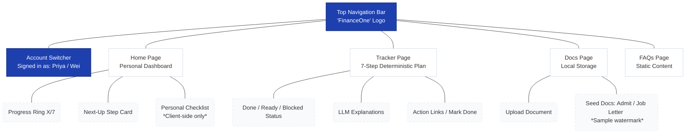

# Design Specification: FinanceOne

## Product Identity
* **Name:** FinanceOne
* **Tagline:** "all things finance in your new home"
* **Core Philosophy:** "Anti-Slop" Premium Fintech. We are building a deterministic, state-driven dashboard where the AI acts as an invisible router and a visible artifact-drafter. It must look like a high-end SaaS product (like Stripe), not a generic chatbot wrapper.

## Visual Language
* **Theme:** **Strictly Light Mode.** No `dark:` Tailwind variants.
* **Backgrounds:** Warm cream (`bg-slate-50`) for the global background to feel welcoming and less clinical than pure white. Cards use pure white (`bg-white`) with subtle borders (`border-slate-100`) and soft shadows (`shadow-sm`).
* **Typography:** `Inter` or `Geist`.
  * Primary text: `text-slate-900`.
  * Secondary/Muted: `text-slate-500`.
* **Primary Accent:** Deep, trustworthy blue (`blue-700` or `blue-800`). Used for primary actions and active navigation states.
* **Status Indicators (Critical for the Graph Tracker):**
  * ✅ **Done:** `text-emerald-700`, `bg-emerald-50`, emerald borders.
  * ⏳ **Ready (Actionable):** `text-blue-700`, `bg-blue-50`, blue borders.
  * 🔒 **Blocked:** `text-slate-400`, `bg-slate-50`, dashed borders.

## UI Architecture & Flow

## Page-by-Page Specifications

### 1. Global Shell & Navigation (`layout.tsx`)

* **Header Bar:** Clean white top bar.
* **Left:** FinanceOne wordmark + blue "F1" favicon.
* **Center:** Navigation links (Home, Tracker, Docs, FAQs) with deep blue active states.
* **Right:** Account Switcher dropdown ("Signed in as: [Name ▾]").
* **Interaction Rule:** Switching the active persona immediately clears the existing plan and artifacts from the UI to prevent stale data flashing under the wrong account.

### 2. Home Page (Personal Dashboard)

* **Goal:** Immediate orientation. Shows the student exactly where they are and what to do next.
* **Left Column (Deterministic Engine):**
  * **Progress Ring:** An animated SVG circular progress indicator showing X out of 7 completed steps.
  * **Next-Up Card:** Driven by the deterministic `recommend.py` logic. Displays the highest priority READY step. Includes a primary "Mark Done" button.
* **Right Column (Sandbox):**
  * **Personal Checklist:** A client-side only (localStorage) to-do list where students can add custom tasks (e.g., "Buy SIM card"). Visually distinct from the official plan (uses standard checkboxes). It is explicitly *not* wired into the resolver.

### 3. Tracker Page (The Money-Shot)

* **Goal:** Visualize the deterministic 7-step dependency graph and the LLM's tailored explanations.
* **Layout:** A vertical stack or timeline of 7 `StepCard` components.
* **Card Anatomy:**
  * **Header (Instant Load):** Step Title, Status Badge (Done/Ready/Blocked). If blocked, includes a prominent red/amber note: "Blocked by: [Prerequisite Step]".
  * **Body (Async Load):** The LLM-generated explanation (via Groq API).
  * **Loading State:** The card structure renders instantly based on the deterministic backend. The explanation block shows a subtle inline spinner (`Loader2` from `lucide-react`, text-slate-400) and "Fetching details..." text while waiting for the LLM. It smoothly fades in once the text arrives.
  * **Footer (Actions):**
    * Includes real, verified outbound links (e.g., ISSS Portal, SSA Office Locator) styled as secondary buttons.
    * If the step is READY, displays a prominent "Mark as Done" button that updates the backend state.

### 4. Docs Page

* **Goal:** A local document store that grounds the application in reality.
* **Layout:** Grid of document cards.
* **Features:**
  * Simple drag-and-drop / file-input upload zone.
  * **Mock Seeded Docs:** Pre-populated admission and job offer letters. These must include a highly visible, slightly transparent red banner across the top reading **"SAMPLE DOCUMENT — not official"**, with a repeating disclaimer in the footer to ensure they are not mistaken for genuine institutional correspondence.

### 5. FAQs Page

* **Goal:** Quick reference for common questions without breaking the "Anti-Slop" rule.
* **Layout:** Clean accordion/disclosure components.
* **Content:** Strictly static text grounded in the RAG corpus. **No chat input boxes.** This enforces that the AI is doing structured reasoning behind the scenes, not acting as an open-ended chatbot.

---

## Claude Code Scaffolding Prompts Reference

*(Use these exact prompts with Claude Code / Cursor to generate the components)*

**1. Shell & Nav**

> "Update our Next.js global layout and Navigation component. Ensure `globals.css` strictly enforces light mode (no `dark:` classes). The background should be a warm `bg-slate-50`. Build a `TopNav` component. Left side: 'FinanceOne' text logo (slate-900, bold). Center: Navigation links (Home, Tracker, Docs, FAQs) with subtle hover states. Right side: An `AccountSwitcher` dropdown using shadcn/ui reading 'Signed in as: [Name]'. Make sure to use deep blue (`blue-800`) for active navigation states."

**2. Home Page Dashboard**

> "Build the `Home` page component with a two-column layout. Left Column: Build a `ProgressWidget` showing a circular SVG progress ring (X out of 7 steps). Below it, a `NextUpCard` for the recommended step with a prominent `blue-800` 'Mark Done' button if actionable. Right Column: Build the client-side `PersonalChecklist` component. Use standard checkboxes so it looks distinct from the main plan. Use `localStorage` to save tasks, adding the necessary eslint disable comment for `react-hooks/set-state-in-effect` to handle Next 16 SSR hydration rules."

**3. Tracker & Async Loading State**

> "Build the `Tracker` page and its child `StepCard` component mapping through our 7-step plan. Styling by status: 'DONE' (Emerald-50 bg, emerald border), 'READY' (White bg, blue border, subtle shadow), 'BLOCKED' (Slate-50 bg, dashed border, opacity-75). The Header (Title, Status Badge, 'Blocked By' note) and Footer (Action Links, 'Mark Done' button) MUST render immediately. In the Body, implement an async loading state for the LLM explanation: show a subtle inline spinner (`Loader2` from `lucide-react`, text-slate-400) reading 'Fetching details...' that fades out when the Groq API text arrives."

**4. Docs Page & Banners**

> "Build the `Docs` page. Create a grid layout for local documents. Build a `DocumentCard` component. For any document type that is seeded (like `admit_letter` or `job_offer`), add an absolute-positioned banner across the top reading 'SAMPLE DOCUMENT — not official' in red text with a light red background. Include the same disclaimer in the footer. Add a clean drag-and-drop upload zone at the top."
