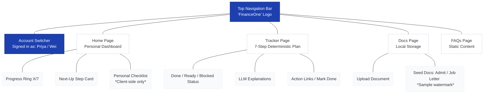

# FinanceOne

**All things finance, in your new home.**

FinanceOne is a personalized financial-onboarding copilot for international students. It resolves a real dependency graph over your specific situation — visa type, job offer status, what you've already done — into a sequenced plan that's correctly gated: you can't request an SSN eligibility letter before completing your ISSS check-in, you can't open a bank account before confirming a US address, and the app knows that, not just narrates it.

## Why this exists

Most guidance for international students setting up their US finances is generic — a list of steps with no real understanding of *your* situation. The actual process is a dependency graph: SSN requires a job offer **and** an ISSS eligibility letter **and** a completed check-in, in a specific order, and whether you're blocked right now depends entirely on facts about you. FinanceOne treats that as what it is — a graph to resolve, not a FAQ to answer.

**The core architectural bet: a deterministic core, with the LLM only at the edges.**

- A plain Python resolver decides step status (`done` / `ready` / `blocked`) and blocking reasons. Zero LLM calls, zero randomness, independently unit-tested.
- The LLM only ever *explains* what the resolver already decided, or *drafts* an artifact (an email, a description) grounded in real school-specific docs — it never gets to re-decide anything.
- Two students, same university, different job-offer status → different resolved plans, and the app can tell you precisely why. That's the whole point.

## What it does

- **Home** — a personal dashboard: an animated progress ring, what to do next (driven by a real recommendation engine, not just "the first blocked thing"), upcoming deadlines, and a personal checklist for the stuff no institution tracks.
- **Tracker** — the full 7-step plan. Each step shows its status instantly (deterministic, no LLM wait), a real link to where you'd actually take the action (the ISSS Portal, not "email the office"), a "Mark done" button gated by the resolver's own state, and an LLM-generated explanation that fades in a moment later once it's ready.
- **Docs** — your admission letter and job offer letter are already there (seeded, clearly marked as samples), plus a real upload zone (drag-and-drop) for your own documents.
- **FAQs** — static, grounded reference content. No chat box, anywhere in the app — that's deliberate.

## Tech stack

| | |
|---|---|
| Backend | FastAPI, Pydantic, LangGraph, Chroma (RAG), Groq (LLM) |
| Frontend | Next.js 16, Tailwind v4, shadcn/ui |
| Deploy | Vercel (frontend) + Render (backend) |

## Architecture



`GET /personas/{id}/plan` is deterministic-only (no LLM wait, ~milliseconds) — the Tracker renders instantly from it. `GET /personas/{id}/explanations` does the LLM work separately, and the frontend merges the result in once it lands, with its own loading state per step. Statuses, blocking reasons, and links never depend on the model being fast, or even available.

```
backend/app/
  resolver.py       the deterministic core — the differentiator
  recommend.py       deterministic "what's next" ranking
  planner.py         LLM explanations, grounded via RAG, never overrides the resolver
  artifacts.py        LLM-drafted email + deterministic .ics calendar generation
  documents.py        local document store + seeded sample documents
  main.py              FastAPI routes
  rag/                Chroma retrieval, two-bucket (school-specific + general)
  schemas/             StudentState, the step graph

frontend/app/
  page.tsx             Home
  tracker/              Tracker
  docs/                  Docs
  faqs/                   FAQs
```

## Setup

### Prerequisites
- Python 3.13+
- Node 20+
- A [Groq](https://console.groq.com/keys) API key (free)

### Backend

```bash
cd backend
python3 -m venv .venv
.venv/bin/pip install -r requirements.txt
cp .env.example .env   # then add your real GROQ_API_KEY
.venv/bin/uvicorn app.main:app --reload --port 8000
```

Check it's up: `curl http://127.0.0.1:8000/health` → `{"status":"ok"}`

### Frontend

```bash
cd frontend
npm install
cp .env.local.example .env.local   # defaults to http://127.0.0.1:8000, fine for local dev
npm run dev
```

Open [http://localhost:3000](http://localhost:3000).

## Usage

- Use the **"Signed in as ▾"** switcher in the nav to move between the two demo accounts — Priya (has an on-campus job offer) and Wei (doesn't). Same university, different resolved plans.
- On **Tracker**, mark a `Ready` step done and watch the recommendation and downstream steps update live.
- Visit **Docs** to see the seeded sample documents, or upload your own.
- Run the deterministic-resolver eval suite anytime, no API key required:

```bash
cd backend
.venv/bin/python scripts/eval_personas.py     # 32 hand-verified checks across 4 personas
.venv/bin/python scripts/verify_resolver.py    # includes a scripted mark-done walkthrough
```

## Deployment

- **Frontend → Vercel**, project rooted (or scoped via `vercel.json`'s `services` block) at `frontend/`, with `NEXT_PUBLIC_API_BASE` set to the deployed backend URL.
- **Backend → Render**, via the `render.yaml` blueprint at the repo root (`GROQ_API_KEY` set as a dashboard secret). The backend stays off Vercel's serverless model deliberately — it depends on a persistent process (in-memory step-completion state, a local Chroma index, local file uploads), none of which suit a stateless, ephemeral runtime.
